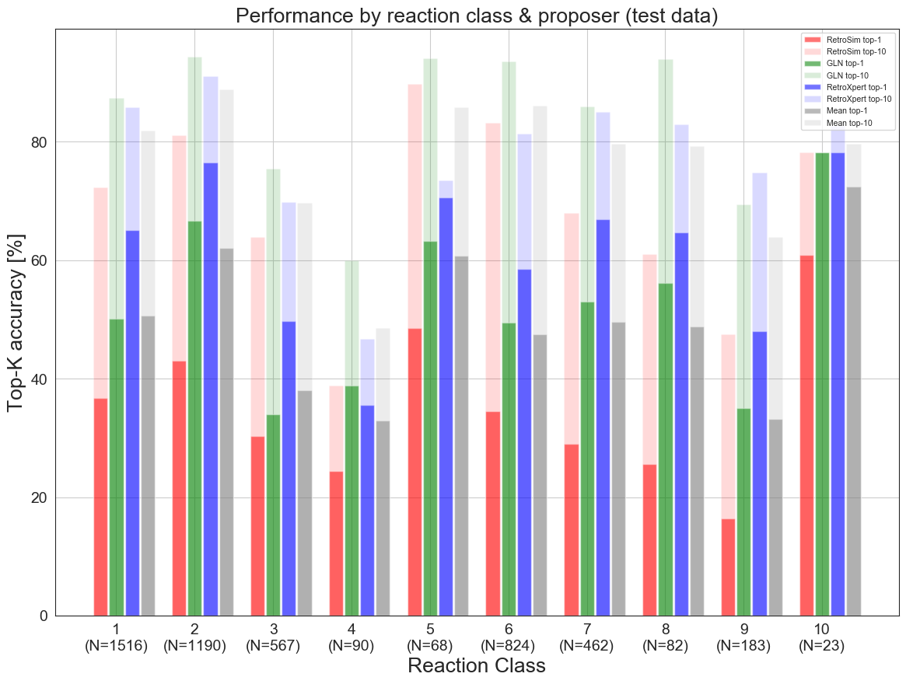
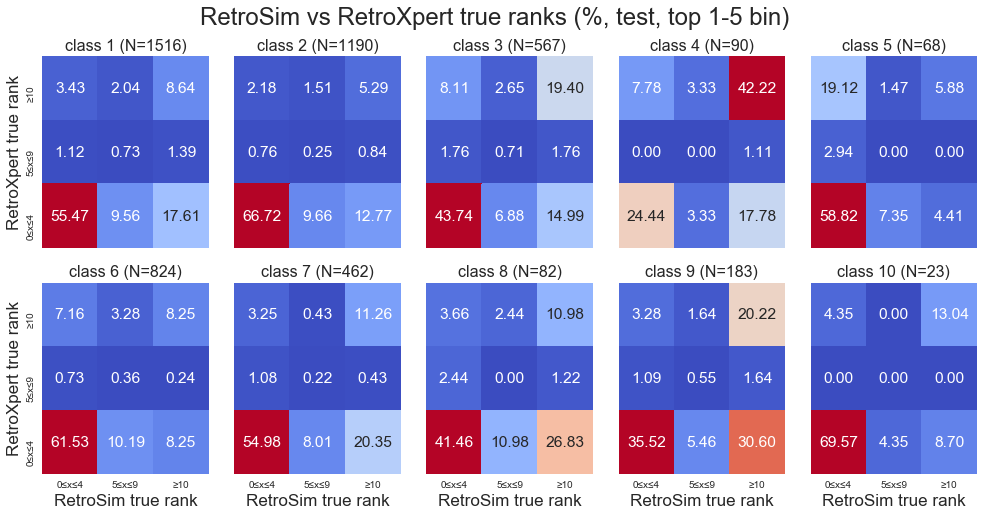
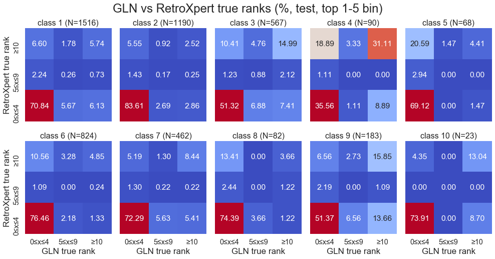
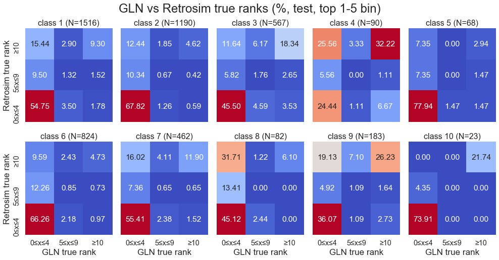

# RetroViz
Visual Analysis of performance of state-of-the-art models for retrosynthesis
The 3 models are:
- RetroXpert: https://github.com/uta-smile/RetroXpert
- GLN (Graph Logic Network): https://github.com/Hanjun-Dai/GLN
- RetroSim: https://github.com/connorcoley/retrosim
- NeuralSym (reimplementation in progress as code is not open-sourced): https://github.com/linminhtoo/neuralsym

I have retrained all 3 models from scratch on a slightly cleaner version of the USPTO-50K dataset than the original authors. Therefore, the predictions & evaluation statistics I got are slightly different (slightly worse actually, because there is some overlap in train & test reactions, which I removed from the training dataset, making the test set slightly harder). Unfortunately I am unable to release the cleaned data files nor the python scripts yet as it is still a work in progress for another project. See below for the link to the prediction CSV files.

## Sample plots
1. Comparing performance across the 10 reaction types in the USPTO-50K dataset. Not much surprises here, except maybe that GLN matches up/beats RetroXpert in classes 4 & 10 in terms of top-1. For top-10 though, GLN is very strong and almost always beats RetroXpert. A key conclusion is that the superiority of a model on the whole (regardless of reaction type) is very similarly reflected within each reaction type. This is good news in that a better model will do better across all reaction types (without having to worry about class-specific performance that much). However, at the same time, this is bad news if we want to squeeze more out of an ensemble of these models, since it doesn't seem possible to say, use GLN for a specific reaction type, and RetroXpert for another reaction type, to yield significantly better overall performance.


2. Also comparing across 10 reaction types, but now, binning reactions depending on whether either or both models predicted the reactants correctly up to some rank (note that rank is 0-indexed, so rank = 0 means proposer recovered the true reactants as its top-1 prediction). These pairwise plots were generated for each pair of proposers.




## Data
CSV files containing top-200 proposals from each of the 3 models are uploaded to [this google drive folder](https://drive.google.com/drive/folders/1NX8iZI3xfUzlXkWsfTyFlGj6srlNSQDd?usp=sharing) As the name suggests, ground truth precursors have been filtered out since we don't need them; instead, just a column 'rank_of_true_precursor' is enough to remember the performance of the proposer. This column is 0-indexed (i.e. rank = 0 means the proposer recovered the true reactants as its top-1 prediction. Rank = 9999 means out of top-200 predictions, none of them matched the ground truth). 

## Requirements & Setup instructions
RDKit is the main package to generate the molecular drawings. Pandas is used to manipulate prediction data from CSV files. Tested on Python 3.6
```
    # ensure conda is initialized first
    conda create -n retroviz python=3.6 tqdm pathlib typing pandas -y
    conda activate retroviz

    conda install -y rdkit -c rdkit
